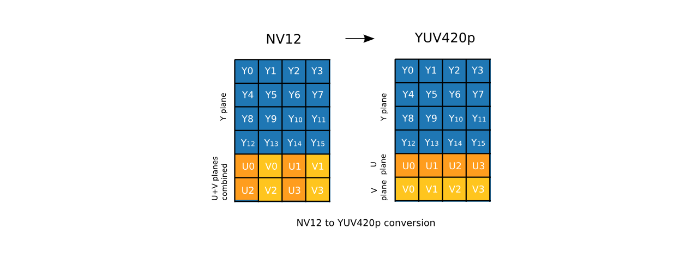
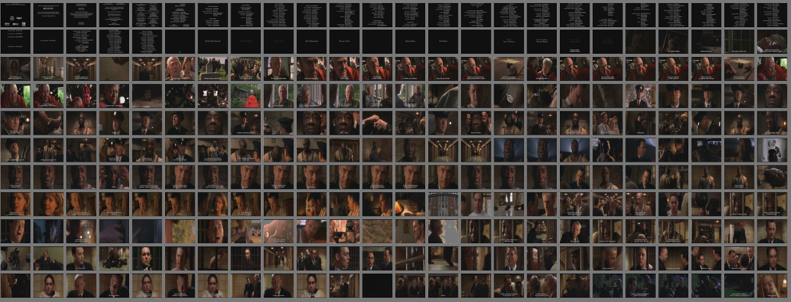

# Fasthumb

 ## What is it?

 Fasthumb is a GPU accelerated high-performance video thumbnail generator
 designed for large video repositories.

 ## How is this useful?

 When dealing with terabytes of video files, you eventually realize the thumbnail
 job you just launched will take hours, maybe even days. If it took you 10 seconds
 to process 1 GB, 20 TB of video content will take nearly 57 hours to complete.

 By using a custom demuxer and leveraging the power of GPU decoding, this can
 be done in under 3.5 hours. There is nothing groundbreaking in this concept, it
 just combines several techniques to speed up the process.

 ## Benchmarks and comparison

 FFmpeg is a great piece of software - stable, rich in features and seriously
 well designed. It can generate thumbnails quite fast, maybe even faster with
 some options I haven't figured out yet. Because of the large volume of data, I
 decided to try and roll out my own solution since even a little extra speed
 was worth it. Also, the _-discard nokey_ FFmpeg option works well on MP4
 containers, but seems to have no effect with MPEG TS streams.

Input parameters

    Video file - 3.2 GB, 181 min, CBR 2300 kb/s, 720x576 25 FPS PAL, AVC Main@L3.1, 271500 frames total
    Thumbnails - 240:192 (scale 3x) JPEG quality 70, 1 every ~10 seconds

 ### Comparison

 1. FFmpeg, multi core on Ryzen 1700

        ffmpeg -discard nokey -i input.mp4 -vf "scale=240:192,fps=1/10" -q:v 2 img-%04d.jpg

    finished in 21,818 seconds, averaging 12443,85 fps. Not bad at all!

 2. Fasthumb - finished in 2,1 seconds, averaging 129285 fps.

 Disclaimer - most of the frames didn't even need to get processed, but
 displaying FPS like this looks way cooler :-)

 

 ## How does it work?

 

 ### Demuxer

 First thing that affects performance is what the demuxer passes on to the
 decoder.  Since thumbnails are usually spaced few seconds apart, it helps not
 having to burden the decoder with processing the parts inbetween - these can
 simply be skipped. It is possible to focus only on the intra/keyframes as they
 are sufficient to produce a single frame without referencing any other frames
 before or after.
 
 The ratio of non-keyframes to keyframes and key-frame intervals depend on the
 encoder settings, but non-keyframes usually take up most of the space (up to
 75%) and can be immediately discarded. Also, IDR / keyframes are rarely more
 than 2 seconds apart. With thumbnail spacing set to 10 seconds, at least 4 out
 of 5 key-frames can be discarded as well, leaving not more than 10% of the
 total video payload left to process. 
  
 

 ### Decoder

 Decoding H.264 requires computing power which is usually the performance
 bottleneck. Hardware acceleration can make it much faster because the
 calculations are done in a highly efficient manner.

 NVIDIA GPUs, starting with the _Fermi_ generation, come with an integrated
 hardware video decoder engine. This decoder engine is used to quickly decode
 the demuxed keyframes and resize the result to desired dimensions.

 ### Colorspace conversion

 The decoded image is represented in NV12 image format, and turbojpeg library
 used for image compression expects YUV420p. NV12 has intertwined U and V planes
 and YUV420p provides them separately. All of this happens after resize - given
 the small image dimensions, this doesn't represent a bottleneck and using a
 CUDA kernel to do the transform would likely be an overkill.

 

 ### JPEG compression

 NVIDIA GPU can do JPEG _decoding_, but according to the documentation it
 doesn't provide accelerated JPEG _encoding_. The choice is to either implement
 a JPEG encoder with partial CUDA acceleration (discrete cosine transform, color
 transform) or switch to a software library and leverage the CPU for this work.

 Halving the width and height reduces the number of pixels 4 times. Consequently,
 resizing the image to a thumbnail significantly reduces the computational
 complexity of operations needed to do JPEG compression. This makes it
 possible to perform compression in software without heavy performance
 penalties.

 The chosen method was using Turbo JPEG library which uses SIMD instructions
 to accelerate the process.

 Some thumbnails generated:

 

 ## Requirements

 - Nvidia SDK (tested and compiled against [CUDA 9.1](https://developer.nvidia.com/cuda-91-download-archive))
 - Turbo JPEG library (install using your distribution package manager) 
 - GNU C++ compiler
 
 ## Installation

 1. git clone the repo
 2. run make

 ## License and credits

 This code is released under the BSD license. 

 - nvcuvid.h and cuviddec.h are property of Nvidia (great work!)
 - parts of code inspired by https://github.com/roxlu/nvidia-h264-decode, thanks!

 ## Limitations and To-Do features list

 - Currently it works only on MPEG TS input files. There may be mp4 support
   in the next release (if there is one :-))

 - Video PID needs to be known in advance and provided to the program. In
   large repositories it's often constant. If you need this, drop me a line and
   I'll add it for you.

 - JPEG naming convention is pretty-much hardcoded (frame number dot jpg), 
   change it as you wish.

 - JPEG generation should probably be multi-threaded, another round of
   profiling and re-write could possibly improve performance even more. To be
   determined.

 - This software is ~250 single lines of code, please keep that if you think of
   a feature it cannot do. It was written over a weekend of coding and I
   decided to share and (possibly) help somebody out.
   
   If you got this far, thanks for reading and good luck. Drop me a line if 
   you find it useful!
